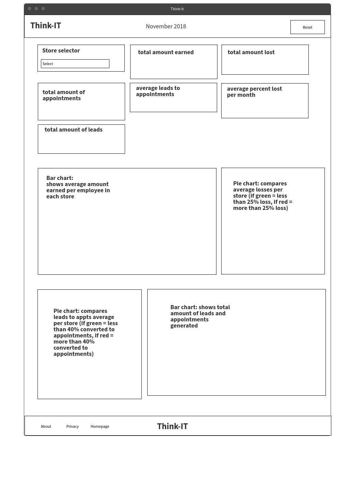

# Think-it: data visualization dashboard

This website is currently only hosted on Github pages, and can be run by clicking [here](https://brookk16.github.io/Think-IT/).

This is a monthly sales data visualization dashboard, focusing on providing the data on each of their 10 store's: 
revenue, losses, leads and appointments. This dashboard provides the means to quickly view summary data for each/all the stores, and to compare their performaces. 

## User Experience

>#### Background information
>Think-it is a fake company created for the purpose of showcasing interactive-front end design, including the use of: javascript (jquery, D3, DC and crossfilter) and front end design (HTML, CSS and using associated libraries). Please also note that the use of Jquery UI and SCSS may not be typically required for such a small project, as they can slow down the site. But were used to show their effective implementation in a project.

>It is a technology based sales company, specialising in technology solutions (i.e using technology to implement some improvement for home and businesses), that uses stores/calling to assess customer requirements (this is what is referred to as a "lead"). These "leads" are then converted to appointments, if the customer wishes to continue on with the sale and further plan their requirements. "Earnings" are considered to be the total amount of money brought into the company by an employee. Whilst "lost" is considerd to be any money that is returned to a customer, irregardless of the circumstances of that return. For example: returns through both employee fault and customer decision are both considered "lost earnings".

This dashboard is designed to be linked to a larger site, for management level staff at Think-IT to be able to quickly and effectively view sales data on all 10 stores, and compare their results. Below you can read some specific user requirements, presented for this project:

* As a store manager, it's important for me to be able to view the performace of other store, so that I can motivate my salespeople to surpass targets.
* As a regional manager, I want to be able to quickly view summary data from our stores, in a easily digestible manner, so that I can produce plans and approaches to counter any loses in profits.
* As a store manager, It would help if I could see the actual figures of how my store is doing, in a simple format, so that I can not only see which areas we may be underperforming, but also what we do well on a monthly basis.

The overall aim therefore, was to design a dashboard with readily available information that would be of most relevance to the users (i.e: store managers and above). Currently, the dashboard displays the most desired metrics used to assess sales performace, identified by the users.Such as:

A wireframe of the orignal requirement can be found  

## Features

### Indicators

The dashboard consists of **6 number displays** in total, which act as quick indicators of the major KPI's:

_please note that all number displays will show the company totals/averages when not filtered (i.e: all the stores data), and a specific store's data, when said store is selected by the filter_

1. <a name="leads_to_appts_formula">Average amount of leads that were converted to appointments, in that month. This was calculated using the following forumla:</a>
 
   * *__(total amount of appointments / total amount of leads) x 100__*

2. <a name="earnings_formula">Average amount of earnings lost, in that month. This was calculated using the following formula:</a>
 
   * *__(total amount lost / total amount of earned) x 100__*

3. Total amount earned per month. 

4. Total amount lost per month. 

5. Total amount of leads generated in that month.

6. Total amount of appointments generated in that month.

### Charts

The dashboard consists of **4 charts** in total, with 2 different types:

##### Bar charts: 2

1. Average amount earned, in each month. This average was calculated by subtracting each employee's total amount lost from their total amount earned. These values are then totaled for each store, then divided by the amount employees to give us the store average.

2. Total amount of leads and appointments generated in each month. With leads being displayed in blue, and appointments shown in dark blue.

##### Pie charts: 2

1. Shows which stores are losing less than 25% of their earnings. If a store is loosing less than 25% of their earnings, their segment with be displayed in green. If they are losing more than 25% of their earnings, their segment will be red. This was calculated using the same formula explained in [bar charts no.2](#earnings_formula) above.

2. Shows which stores are converting more than 40% of their leads to appointments. If a store is converting more than 40% their segment will be green. If they are converting less than 40%, their segment will be red. This was calculated using the same formula explained in [bar charts no.1](#leads_to_appts_formula) above.

There is also a "Store selector" select bar, which allows users to quickly filter out all but the selected store's data. Upon clicking on the select bar, all the store's locations will be displayed (one store for each state) along with their number of employees.

Every chart bar/segment can be hovered over to see the exact figure displayed as a hover message:

* ex: Hovering over the "Texas" segment in the leads to appts conversion pie chart (pie chart 2) will display this message:
  
  _Average leads to appointments in Texas is 47%_

Some charts also have a hover over tooltip, indicated by a "**?**" symbol. Simply hover over the "**?**" the see a tooltip appear that provides more detailed information on how the value(s) were calculated.

 you can dynamically filter data. This can be achieved by using the aforementioned select bar, or by simply clicking on the segment/bar of the data you want, to filter out all data from the other stores. You can also see multiple store's data at one time, for more precise comparison, by clicking on muliptle bars/segments. To reset the charts, re-click on the same clicked bars/segments. Or simply use the "reset" button, which is located at the top right of the screen.

### Other features 

At the top centre of the screen, there is a date display, which shows the current date, using javascript code within the "month.js" file. This code simply displays the current month and year. 

> Please note that this system is designed to accept a new sales-data.csv file every month. This new file would replace the previous file, displaying thst month's data. However, for the purpose of this project, only one data file is used that was generated in November. Therefore, the data will always be for November 2018, whist the data display will always show the current month and year.

Finally, this project has the scope to be able to add additional charts and features, quickly and efficiently, should the users feel it is required.

## Technologies used

* [Bootstrap](https://getbootstrap.com/docs/4.0/getting-started/introduction/) 4.1.3
  

* [Fontawesome](https://fontawesome.com) 5.5.0
  * Used to provide icons for the: hover tooltip, logo, reset button pass and fail icons.

* [Google fonts](https://fonts.google.com)
  * Used the following fonts:         [Pacifico](https://fonts.google.com/specimen/Pacifico) for the "Think-IT" logo and [Archivo](https://fonts.google.com/specimen/Archivo+Black) for the body text.

* [Jquery](https://jquery.com) 3.3.1
  * Used for the additional javascript functions (located: assets/js): hover.js, hamburger.js and month.js
  * Also used with [Jquery UI](https://jqueryui.com) 1.12.1 (CSS: 1.11.4), to handle the custom styling on the tooltips.

* [D3](https://d3js.org) 3.5.17 
  

* [DC](https://dc-js.github.io/dc.js/) 2.1.8 (DC CSS 2.1.8) and [Crossfilter](http://square.github.io/crossfilter/) 1.3.12
  

* [Queue](https://github.com/d3/d3-queue) 1.0.7
  * Used to force D3, DC and Crossfilter to wait until the data is fully loaded before rendering charts.

* [SCSS](https://sass-lang.com) was used to add more programmatic features to styling (and, as mentioned in "Background information", to demonstrate its effective use).

* To generate the data for this project, [Mockacroo](https://www.mockaroo.com) was used. Please view the data.csv file (using excel) to view the raw data. Mockaroo generated 500 employee's for the Think-IT company, randomly assigning them to a state/store, and generating their (min value: max value): leads generated (0:50), appointments generated (0:25), amount earned (0:50,000)and their amount lost (0:11000).

## Testing

#### How user requests were met

To comply with user requirements, we ensured that all the most data is readily available as number displays at the top of the screen. This is where the select bar is also located, so that users can quickly choose a store/state and see the relevant data.

Also, in addition to the inbuilt filtering capabilites, provided by Crossfilter, a reset button is provided in the header. Which is easily seen and resets the data with a click.

Large format bar charts are provided to provide an easy way to compare store performances. And pie charts with clear colour distinctions, show whether stores are meeting company targets.

Finally, the site is designed to be easiliy reset each month, by uploading and replacing the current "sales-data.csv" file (located: in the "data" folder). The site will automatically reload, performing the same neccessary calculations, to provide the same information for that month.

#### Code testing

#### Site testing

Testing was conducted as follows:
1. Once all code was written, [HTML](https://validator.w3.org) and [CSS](https://jigsaw.w3.org/css-validator/) code validators were used.

2. Then, all the sites feautuers were used thorughly by several independent testers. All were simply asked to use the site, and asked about the information they were seeing. To ensure that not only was each feature working correctly, but also to ensure they could be used/found instinctively (i.e: it was easy to achieve their tasks).

3. Once functionality had been established to be working correctly and sufficiently, Google's developper tools provided an audit to assess the quality of the website. Achieving high scores in all relevant areas (in the categories covered by current stage of the course).

4. After any revision of code, the testing began again from stage 1, and continues until the final code is reached.

#### Data testing

To confirm that the data being rendered in the charts were correct, independent tests were conducted on the data (in excel). The results may be found in the table below (formulas for how leads to appointments and percent lost can be found in the [Features](#leads_to_appts_formula) section) :

| State        | Employees | Total leads | Total appointments | Total earned | Total lost | actual earned (earned - lost) | Leads to appointments(%) | Percent lost(%) |
|--------------|-----------|-------------|--------------------|--------------|------------|-------------------------------|--------------------------|-----------------|
| Arizona      | 28        | 742         | 338                | 616749       | 159166     | 457583                        | 45.55256065              | 25.80725709     |
| California   | 139       | 3768        | 1853               | 3427056      | 801919     | 2625137                       | 49.17728238              | 23.39964681     |
| Florida      | 98        | 2486        | 1200               | 2431854      | 577808     | 1854046                       | 48.27031376              | 23.75997901     |
| Maryland     | 13        | 308         | 182                | 274519       | 76110      | 198409                        | 59.09090909              | 27.72485693     |
| Mississsippi | 5         | 133         | 73                 | 145069       | 15855      | 129214                        | 54.88721805              | 10.92928193     |
| Nebraska     | 3         | 100         | 18                 | 37361        | 15417      | 21944                         | 18                       | 41.26495543     |
| New Jersey   | 11        | 295         | 116                | 251611       | 56647      | 194964                        | 39.3220339               | 22.51372158     |
| Ohio         | 42        | 1143        | 522                | 784284       | 254371     | 529913                        | 45.66929134              | 32.43353173     |
| Texas        | 144       | 3480        | 1645               | 3419626      | 808496     | 2611130                       | 47.27011494              | 23.64281942     |
| Washington   | 17        | 444         | 164                | 468215       | 99709      | 368506                        | 36.93693694              | 21.29555866     |
| Totals       | 500       | 12899       | 6111               | 11856344     | 2865498    | 8990846                       | 47.37576556              | 24.16847892     |

#### Responsiveness

 The site is fully responsive and functional across all screen sizes. With each chart reshaping to fit the current screen size, and a collapsable hamburger menu, for the link items in the footer. However, this dashboard is designed primarily to be used on desktop machines. Due to the sizes of some of the charts, and as the charts use svg elements, they do not reshape themselves to fit. Thus scrollbars will appear on smaller screen sizes, to compensate for their larger size. 
 
 
 ## Deployment
 
 The project is hosted on Github pages.
 
 However, please be aware the repository contains additional files not required for the functionality of the website, but for the purpose of the course. 
 
 These files are all located in the "Course" folder, and contain: the sales-data summary file and a  wireframe of the original concept (think-it-wireframe.png). A folder containing minified files of the HTML and JS files (that run quicker than the full-size versions), can also be found within the folder "minified_files".
 
* To minify HTML, [html minfier](https://github.com/kangax/html-minifier) was used.

* To minify CSS, [cssnano](https://cssnano.co) was used.  

* To minify JavaScript, [Uglify JS](https://www.npmjs.com/package/uglify-js) was used.
 
## Credits

The "Think-IT" logo was created by combining the Google font [Pacifico](https://fonts.google.com/specimen/Pacifico) and the fontawesome ["question circle"](https://fontawesome.com/icons/question-circle?style=solid) logo.

#### Acknowledgements

* [Mockaroo](https://www.mockaroo.com) was responisble for generating the data for this project.
* Inspiration for the design of the website came from [Toutapp](https://www1.toutapp.com/product-2/).
* The code for the "month.js" file came from, and was modified from the [W3schools](https://www.w3schools.com/howto/howto_js_topnav_responsive.asp) website.
